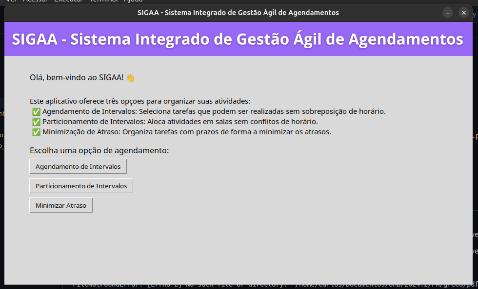
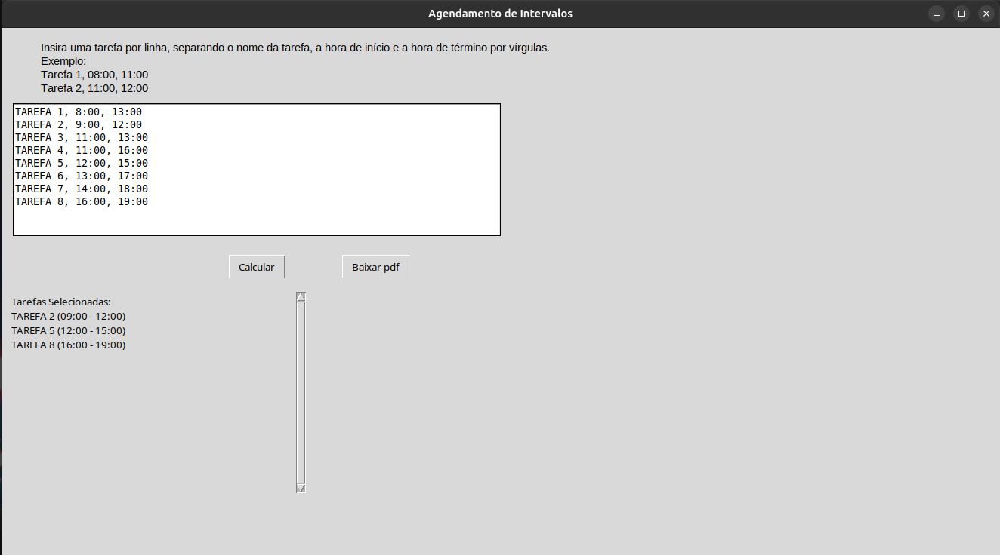
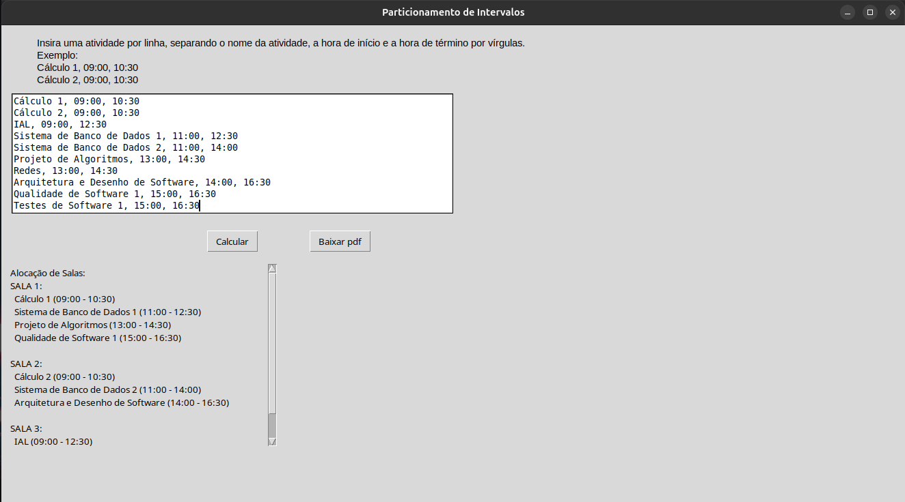
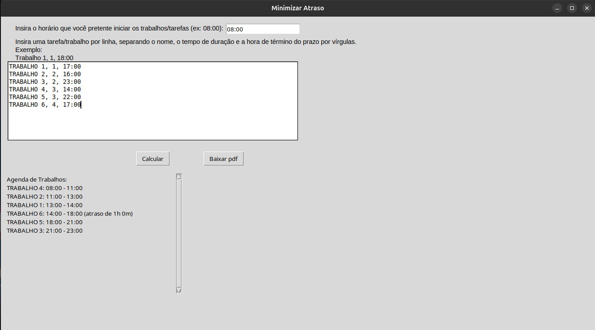
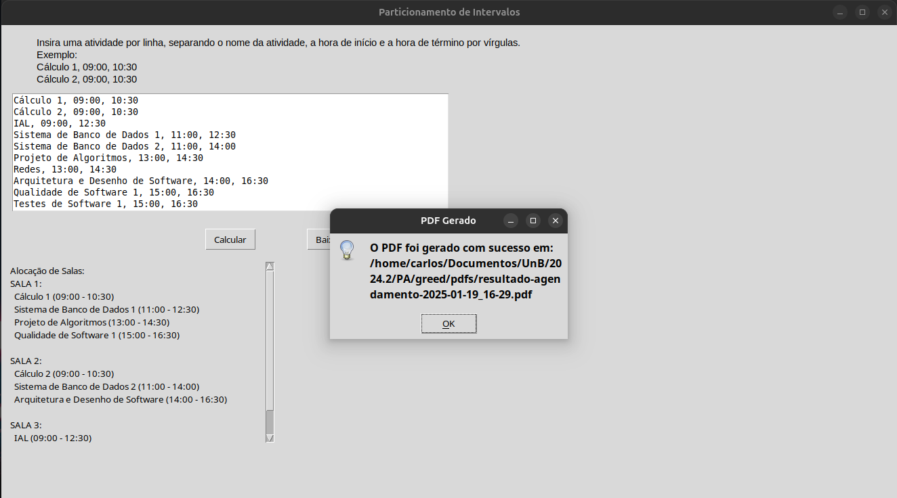

# Greed_SIGAA

**Número da Lista**: 52<br>
**Conteúdo da Disciplina**: Greed<br>

## Alunos
|Matrícula | Aluno |
| -- | -- |
| 22/1031265  |  Carlos Eduardo Rodrigues |
| 22/1037993  |  Patrícia Helena Macedo da Silva |

## Sobre 

Este projeto é uma aplicação em Python que apresenta uma interface gráfica interativa com três algoritmos do módulo GREED. Através dessa aplicação, o usuário pode escolher entre três opções para resolver problemas práticos de otimização de tempo e recursos. Os algoritmos são:

1. ### Interval Scheduling
O algoritmo de Interval Scheduling ajuda o usuário a organizar seu dia de forma a realizar o maior número de trabalhos possíveis dentro de um intervalo de tempo específico. O usuário insere os horários de início e fim, e o algoritmo determina a melhor ordem para realizar as tarefas, maximizando a quantidade de trabalhos que podem ser feitos.

2. ### Interval Partitioning
O algoritmo de Interval Partitioning é útil para a organização de aulas em salas. O usuário insere o horário das aulas, e o algoritmo aloca as aulas em diferentes salas de modo a evitar sobrecarga, ou seja, se duas aulas se sobrepuserem, uma nova sala será aberta para acomodar a aula que não cabe na sala já alocada.

3. ### Scheduling to Minimizing Lateness
O algoritmo de Scheduling to Minimizing Lateness ajuda o usuário a organizar a ordem de tarefas sem intervalos entre elas, de maneira que o atraso total seja minimizado. O usuário, primeiramente, insere o horário de início para a realização das tarefas. Após isso, insere a duração de cada uma e a deadline (prazo de conclusão) de cada tarefa. O algoritmo, então, determina a melhor sequência para concluir as tarefas, buscando reduzir o atraso total e garantir que as tarefas sejam completadas o mais perto possível do prazo estipulado.

## Screenshots







## Instalação 
**Linguagem**: Python 3.12.7  
**Framework**: (não se aplica, pois não há framework específico)

## Pré-requisitos:
- Python 3.12.7 ou superior
- Biblioteca Pillow e Tkinter

## Como rodar o projeto:

1. Certifique-se de ter o **Python 3.12.7 ou versão superior** instalado em seu sistema. Você pode verificar a versão do Python com o seguinte comando no terminal:

   ```bash
   python --version
   ```

   Caso você não tenha o Python 3.12.7 instalado, faça o download no [site oficial do Python](https://www.python.org/downloads/release/python-3127/).

2. Instale a biblioteca **Pillow** utilizando o **pip**. No terminal, execute o seguinte comando:

   ```bash
   pip install pillow
   ```
3. O Tkinter já vem pré-instalado com a maioria das distribuições do Python. No entanto, caso você esteja utilizando uma distribuição que não inclua o Tkinter, você pode instalá-lo utilizando o seguinte comando:
   ```bash
   sudo apt-get install python3-tk
   ```
4. Instale a biblioteca **reportlab** utilizando o **pip**. No terminal, execute o seguinte comando:

   ```bash
   pip install reportlab
   ```

## Uso 
1. ### Interval Scheduling - Maximizar o número de trabalhos realizados
O algoritmo Interval Scheduling ajuda a organizar seu dia para realizar o maior número de tarefas possíveis dentro de um período de tempo específico.

Como usar:
Insira o nome de cada tarefa, o horário de início e o horário final de cada uma delas. O formato deve ser:
Exemplo: 
```
Tarefa 1, 14:00, 18:00
(isso significa que o Trabalho 1 começa às 14:00 e termina às 18:00).
```
Após inserir todos os trabalhos, clique no botão "Calcular".
O algoritmo irá ordenar os tarefas de forma a maximizar a quantidade de tarefas realizadas, respeitando os horários de início e término inseridos.
A agenda será exibida, mostrando quais tarefas você pode realizar e em que horários, sem sobreposição.
Exemplo de uso:

Você tem as seguintes tarefas:
```
TAREFA 1, 8:00, 13:00
TAREFA 2, 9:00, 12:00
TAREFA 3, 11:00, 13:00
TAREFA 4, 11:00, 16:00
TAREFA 5, 12:00, 15:00
TAREFA 6, 13:00, 17:00
TAREFA 7, 14:00, 18:00
TAREFA 8, 16:00, 19:00
```
Após calcular, o algoritmo irá te mostrar a sequência de trabalhos que você pode fazer para aproveitar ao máximo o tempo disponível, sem sobreposição de horários.

2. ### Interval Partitioning - Divisão de salas para aulas
O algoritmo Interval Partitioning organiza as aulas em diferentes salas de acordo com os horários de cada uma. Se uma aula entrar em conflito com a última, uma nova sala será aberta.

Como usar:
Insira o horário de início e término de cada aula. O formato deve ser:
Exemplo:
```
Aula 1,09:00, 11:00
```
Após inserir todos os horários das aulas, clique no botão "Calcular".
O algoritmo irá alocar as aulas em salas, criando novas salas sempre que for necessário para evitar conflitos de horários.
Exemplo de uso:

Você tem os seguintes horários de aula:
 ```
Cálculo 1, 09:00, 10:30
Cálculo 2, 09:00, 10:30
IAL, 09:00, 12:30
Sistema de Banco de Dados 1, 11:00, 12:30
Sistema de Banco de Dados 2, 11:00, 14:00
Projeto de Algoritmos, 13:00, 14:30
Redes, 13:00, 14:30
Arquitetura e Desenho de Software, 14:00, 16:30
Qualidade de Software 1, 15:00, 16:30
Testes de Software 1, 15:00, 16:30
 ```
O algoritmo verificará que as aulas 1 e 2 têm conflito e alocará a Aula 2 em uma nova sala. A Aula 3 pode ser alocada na mesma sala da Aula 1, pois não há sobreposição.

3. ### Scheduling to Minimizing Lateness - Minimizar o atraso total
O algoritmo Scheduling to Minimizing Lateness ajuda a organizar as tarefas sem intervalos entre elas de forma a minimizar o atraso total. Ele organiza a sequência das tarefas de modo que o atraso total no cumprimento dos prazos seja o menor possível.

Como usar:
Primeiramente insira o horário de que deseja começar a realização das tarefas. Após isso, insira o nome de cada tarefa, a duração e a deadline (prazo) de cada uma delas. O formato deve ser:
Exemplo: 
```
8:00 
Tarefa 1, 2, 12:00
(isso significa que o horario de inicio das realizações de tarefa é as 8:00, a tarefa 1 dem duração de 2 horas
e sua deadline é as 12:00hrs).
```
Após inserir todas as tarefas, clique no botão "Calcular".
O algoritmo irá calcular a melhor ordem de execução das tarefas de forma a minimizar o atraso. Ele leva em consideração o horário de início, a duração de cada tarefa e os prazos estabelecidos para determinar a sequência ideal.
A agenda será exibida com os horários de início e término das tarefas, além de indicar, caso haja, os atrasos em horas e minutos.
Exemplo de uso:

Você tem as seguintes tarefas:
```
8:00
TRABALHO 1, 1, 17:00
TRABALHO 2, 2, 16:00
TRABALHO 3, 2, 23:00
TRABALHO 4, 3, 14:00
TRABALHO 5, 3, 22:00
TRABALHO 6, 4, 17:00
```
O algoritmo irá calcular a ordem de execução das tarefas para minimizar os atrasos e exibirá a sequência com o tempo de atraso (se houver).


